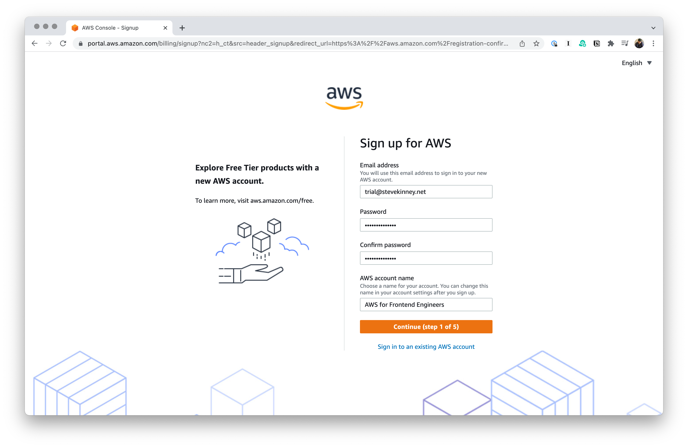
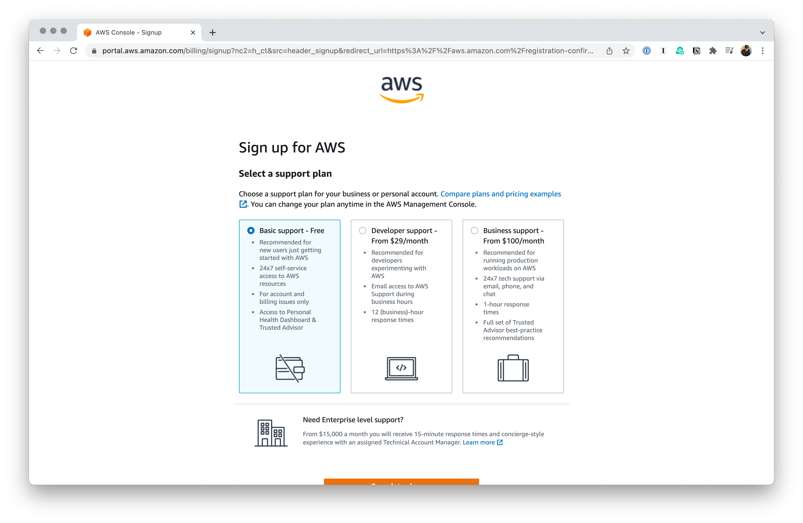
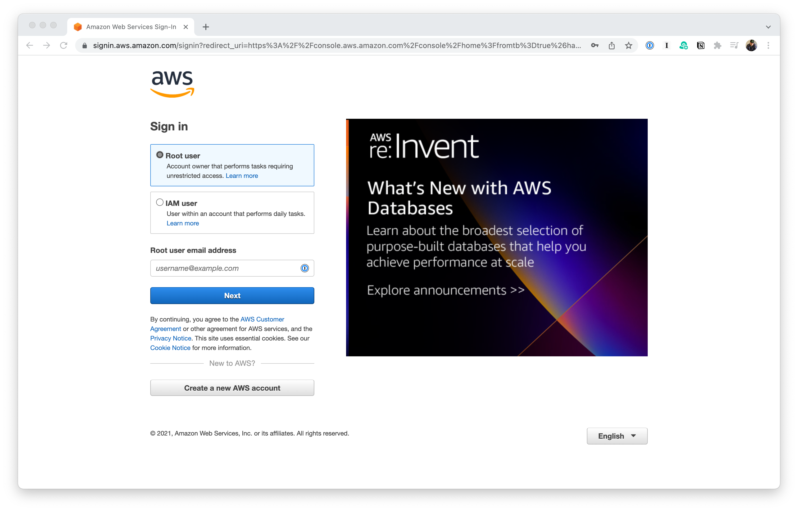

# Account set up

Signing up for an account is pretty much what you'd expect it to be.

I'm going to give you a few minutes to sign up for an account—mostly because I'm not super interested in live-streaming my phone number, credit card number, and home address.

You'll need to fill out a bunch of fun CAPTCHAs. You owe it to yourself to switch it into the mode where you have it read the numbers to you. It'll haunt you for months.

**Note**: You will need a credit card to sign up for an AWS account.

# Logging in for the first time

At first, you're going to log in as the root user—because that's all you have right now. But, it's kind of like rolling at `root` on your computer. It's probably a bad idea. So, we'll set up some guard rails for ourselves in a little bit.
