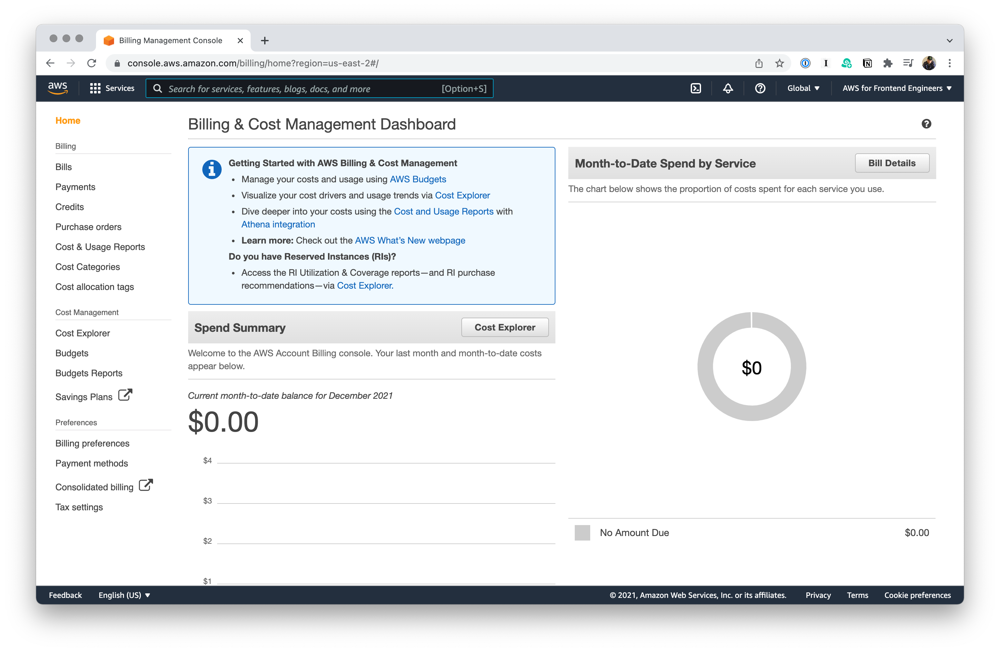
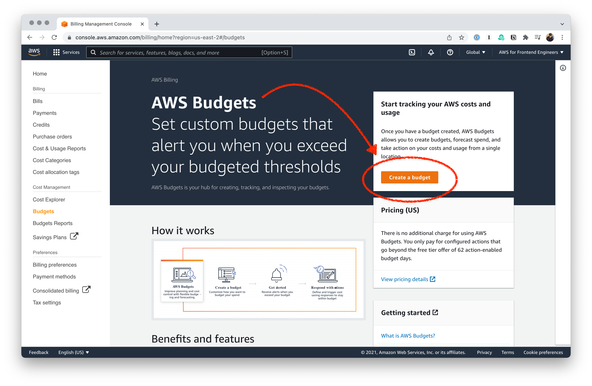

# Billing

Let's set up some structure to make sure we don't run up a big AWS tab.

Let's head over to "Billing preferences" in the side bar and make some adjustments. We're going to turn on **Receive Free Tier Usage Alerts**.

Next, we'll visit "Budgets" and click on the **Create a budget** button.

We're limited in the types of budgets we can create, but we're able to create the only kind of budget that I personally care about right now—a **cost budget**.

We'll set the cost to $10 and we'll put in an email alert when we hit 80% of that. I left the accounts that I made 3 years ago for the first version of this course running and I have never received one of these billing emails.
