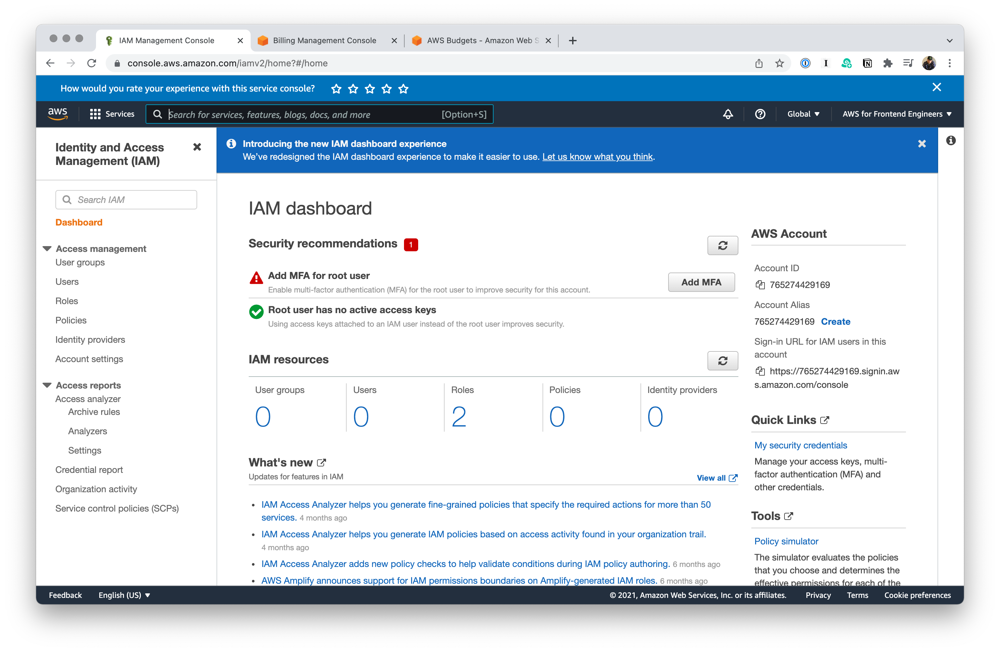
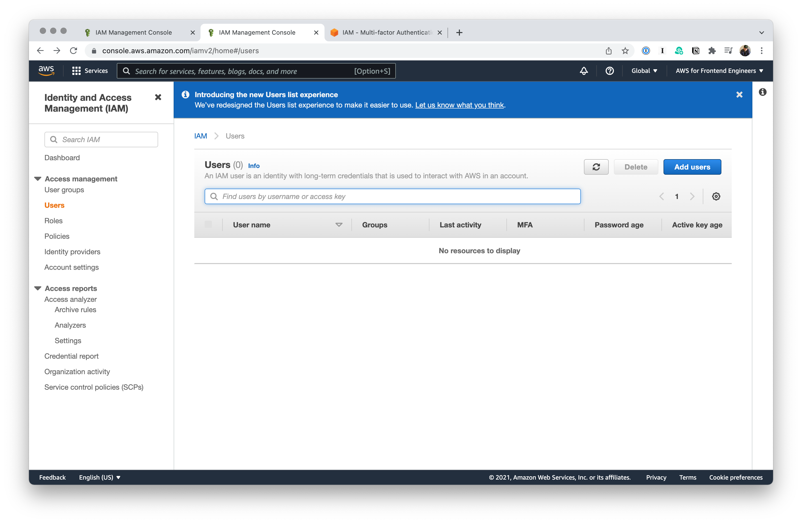
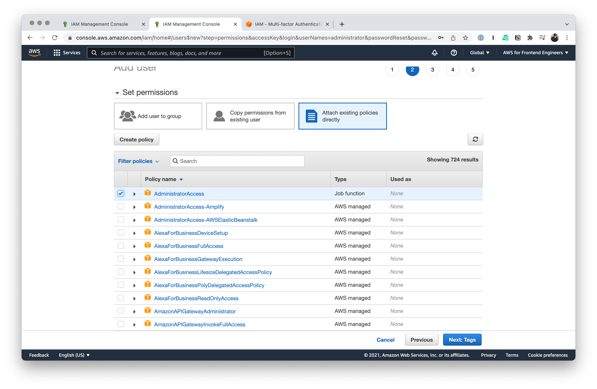
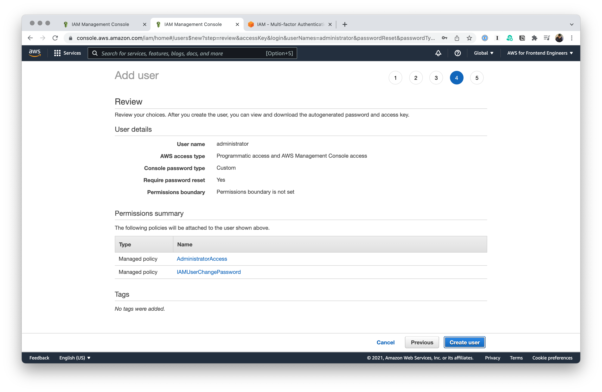
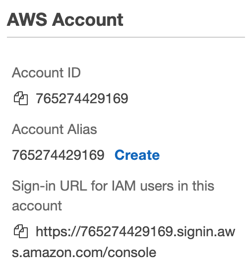

# IAM

IAM stands for **I**dentity **A**ccess and **M**anagement.

Generally speaking, it’s a _bad_ idea to use your root account for anything. IAM how you manage sub accounts in AWS.

Let's do the following together:

- We’re going to turn on MFA for our root account.
- We’re going to make a new user (e.g. _not_ our root account).
- We’re going to turn on MFA for that one too.

## Adding MFA to the root account



Let's start by addressing that first security recommendation there. Click on the **Add MFA** button.

- Scan the QR with your authenticator of choice. I use [Authy](https://authy.com/).
- Put in two authenication codes in a row.

## A new user

Head over to [the Users section of the IAM Dashboard](https://console.aws.amazon.com/iamv2/home#/users) and click **Add users**.



We'll check both:

- ✅ **Access key - Programmatic Access**
- ✅ **Password - AWS Management Console access**


You've got a few options here:

- You can add a user to a group that has a set of permissions.
- You can copy permissions from an existing user.
- You can attach policies directly to a particular user.

For right now, we're going to go with that last option.



This is basically an all-access pass. If you look at the JSON representation of this policy, you can see it's basically just a wildcard.

```json
{
  "Version": "2012-10-17",
  "Statement": [
    {
      "Effect": "Allow",
      "Action": "*",
      "Resource": "*"
    }
  ]
}
```

The one thing you _don't_ have acccess to with `AdministratorAccess` is billing—and that's a good thing. You do have access to 314 other services however.



On this next page, you'll see some important information. Notably, you'll see your **Access key ID** and your **Secret access key**, which is basically your password.

You'll never see that secret access key again unless you download the CSV with the information. Also: that **Send email** link is basically useless, it just opens your mail application and lets you send an email notifying someone that they have an account now, but it doesn't include the relevant details on this page.

## Getting a better sign-in URL

We've made a bunch of green checks now. But, let's do one more thing while we're here. If you look over in that column to the right, we have a lovely sign-in URL that is a bunch of numbers. Gross. Let's create an account alias.



## Add MFA to your administrator user

- Go back into the **Users** section and click on your **administrator** user.
- Go to the **Security credentials** tab.
- Add MFA for that your new administrator user as well.

This is also where you can generate new access keys for this user if you need to.

Once we have all that in place, we'll sign out of our root account for good.
