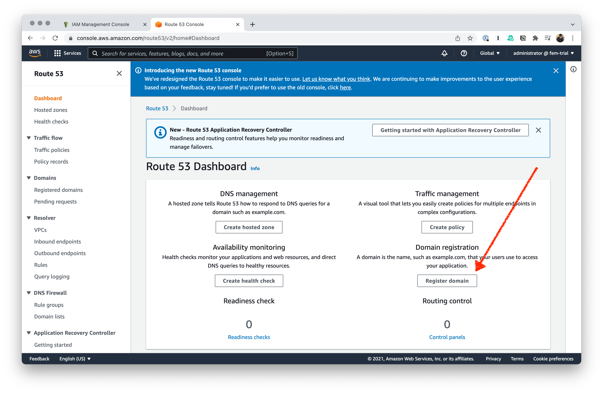
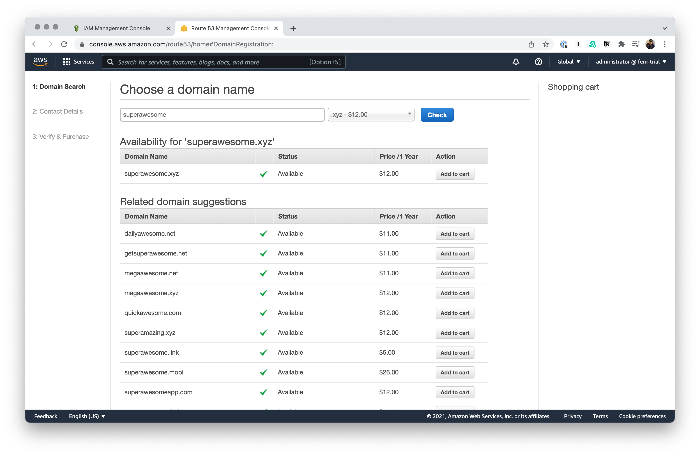
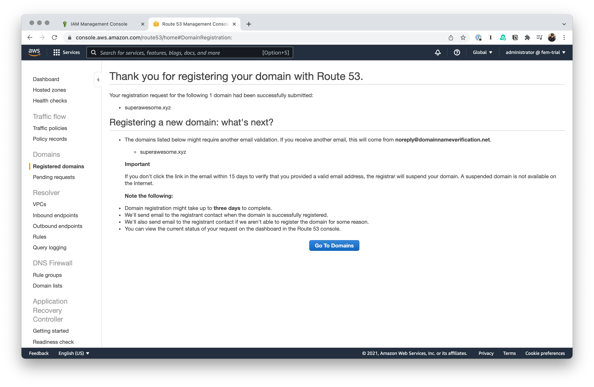
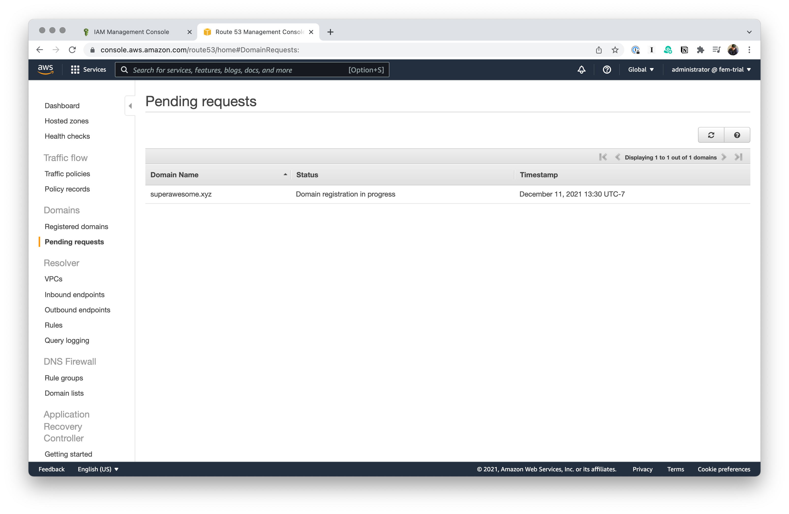

# Registering a Domain

- The is **totally optional**. If you don’t want to purchase a domain name, you’ll skip a few steps as we go along, but you’ll be able to come along.
- We’re going to register a domain name now so that we know we have one that’s unique.
- Also: registration takes some time, so—let’s get it started now.

Next up, you'll fill in your contact details.

It takes a little bit of time to bake, that's why we're doing this now.

