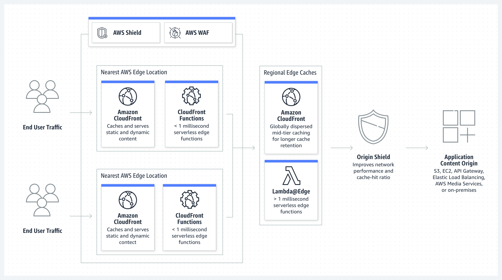
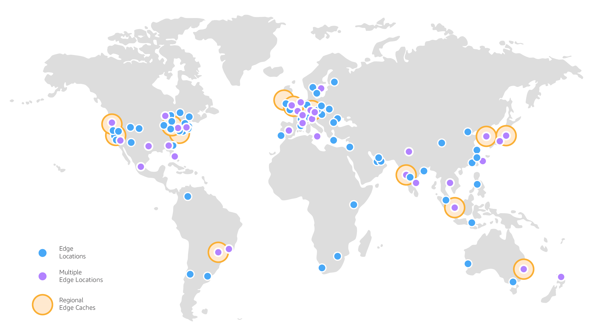
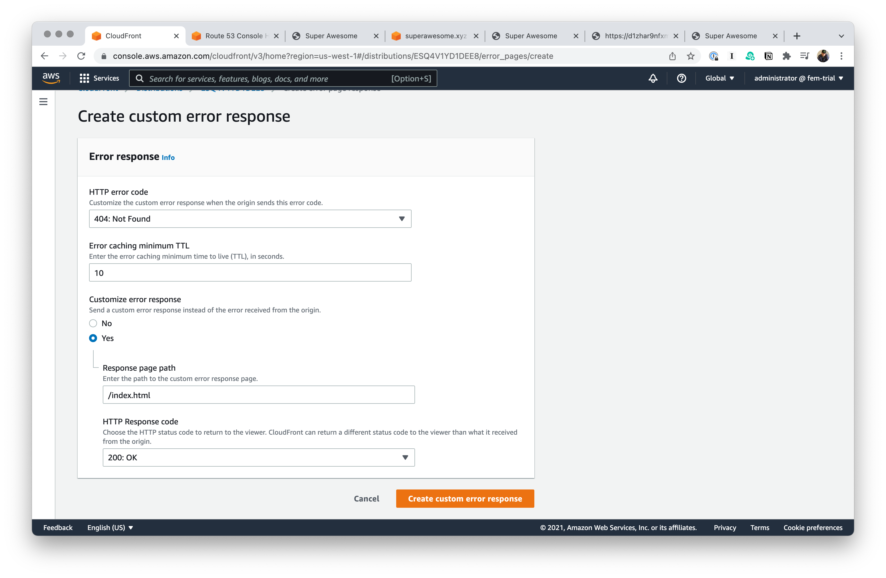

# CloudFront

As my friend, Steven, likes to say CloudFront puts the “eventual” in eventual consistency.

Everything in CloudFront takes a while, so we’re going to just set it up now and then we’ll talk about it while it’s cooking.

Let's talk real quick about what we're going to do before we do it.

- We’re going to create a new CloudFront distribution.
- We’re going to point it to our static website on S3.
- We’ll add our domain names.
- We’ll set up gzipping for our assets.
- We’ll set a default root object.

## Setting up a CloudFront distribution

- **Origin domain** should have have your S3 bucket.
- For a hot minute, we're going to select **Don't use OAI** under **S3 bucket access**.
- In **Alternate domain name (CNAME) _- optional_**, add in your domains.
- **Default root object** should be `/index.html`.

This can take a little bit to deploy.

## Pointing Route 53 at CloudFront

As long as we're waiting for our CloudFront distribution, let's update Route 53 to point at our CloudFront distribution instead of S3.

- Head over to Route 53.
- Go to **Registered domains**.
- Click **Manage DNS**.
- Select your domain.
- Click **View details**.
- Find the `A` record and click **Edit record**.
- Switch **Route traffic to** to **Alias to CloudFront distribution**.
- Select your CloudFront distribution or paste in the URL.
- Click **Save**.

%%**TODO**: Update the list of CloudFront Custom Headers.%%

## Setting Up Error Pages

We're now going to bring in our ability to support client-side routing.

- Go to **Error pages**.
- Click **Create custom error response**.
- Select **404: Not Found** for **HTTP error code**.
- Change **Customize error response** to **Yes**.
- Set **Response page path** to `index.html`.
- Select **200: OK** for our **HTTP Response code**.

To be super clear, this creates an opposite version of the problem we had before. Now, everything is good—even if the URL is invalid. We're still walking down the road of getting this right, but we're slowly improving. Emphasis on the word "slowly."

## Creating invalidations

The good news is that CloudFront will cache all of our assets and skip hitting up S3. The bad news is that CloudFront will cache all of assets and skip hitting S3—even when we deploy a new version of our application.

You can go to the **Invalidations** to create an invalidation.

Invalidations kick things out of the cache. We need this for kicking out our `index.html` when we deploy a new one. You can manually create new invalidations in the UI, but we'll need a better way to automate this.
