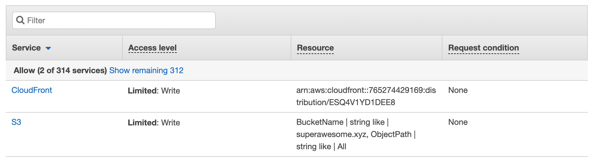
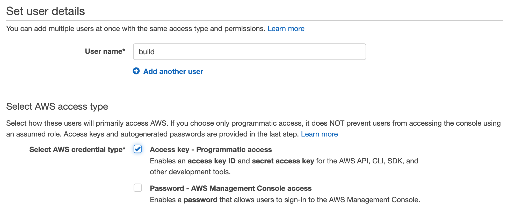
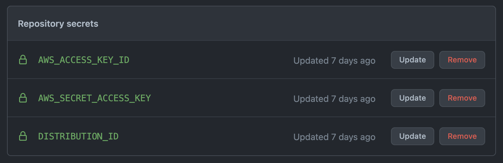

# Implementing a Build Pipeline

## Create a policy

Before we make a user for our build process, let's create a policy—the set of permissions that our build process should have.

We'll make a custom policy using the visual editor. At the end of the day, we want to set the user up with with the bare minimum of what it should be allowed to do.



## Create user for our build process

Let's start by [creating a user](https://console.aws.amazon.com/iam/home#/users) with only the minimal set of privileges.



This user _only_ needs programmatic access. We'll select `BuildProcess` as its role.

## Adding the workflow into Github

**Pro Tip**: If you've forgotten your CloudFront distribution's ID, you can get it fairly quickly using `aws cloudfront list-distributions`.

```yml
name: Deploy Website

on:
  push:
    branches:
      - main

jobs:
  deploy:
    runs-on: ubuntu-latest
    steps:
      - name: Checkout
        uses: actions/checkout@v1
      - name: Configure AWS Credentials
        uses: aws-actions/configure-aws-credentials@v1
        with:
          aws-access-key-id: ${{ secrets.AWS_ACCESS_KEY_ID }}
          aws-secret-access-key: ${{ secrets.AWS_SECRET_ACCESS_KEY }}
          aws-region: us-east-1
      - name: Install modules
        run: npm ci
      - name: Build application
        run: npm run build
      - name: Deploy to S3
        run: aws s3 sync ./build/ s3://${{ secrets.BUCKET_ID }}
      - name: Create CloudFront invalidation
        run: aws cloudfront create-invalidation --distribution-id ${{ secrets.DISTRIBUTION_ID }} --paths "/*"
```

## Adding the secrets into GitHub

The next step is for us add our secrets into GitHub.


