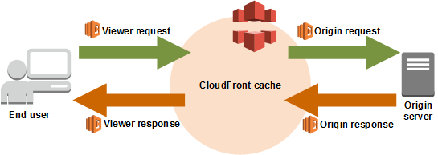
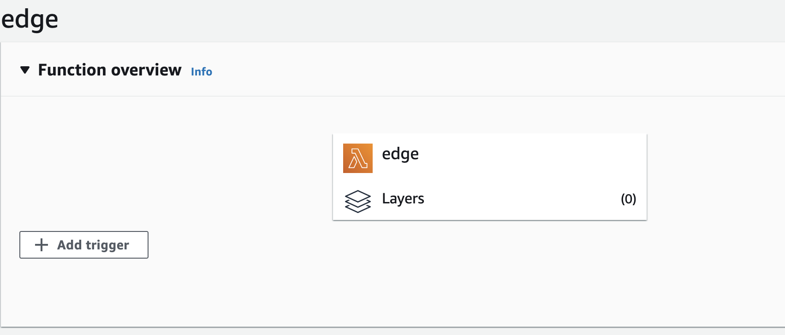
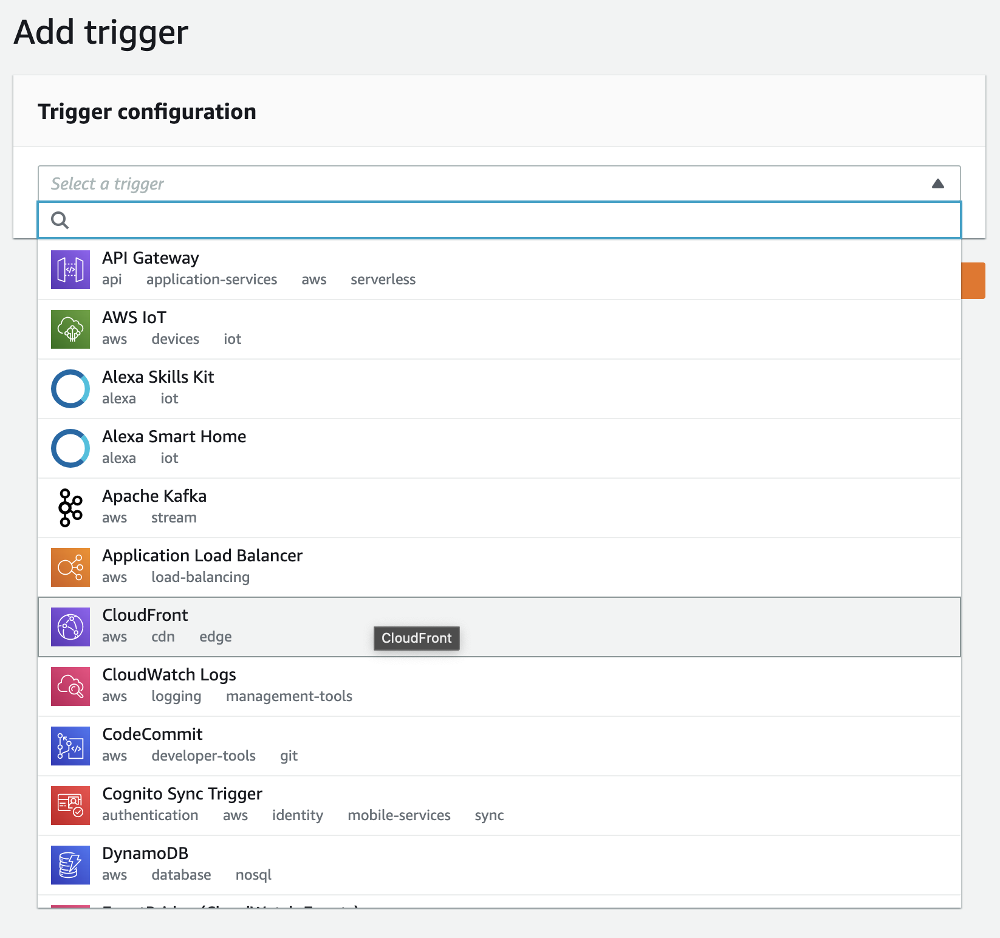
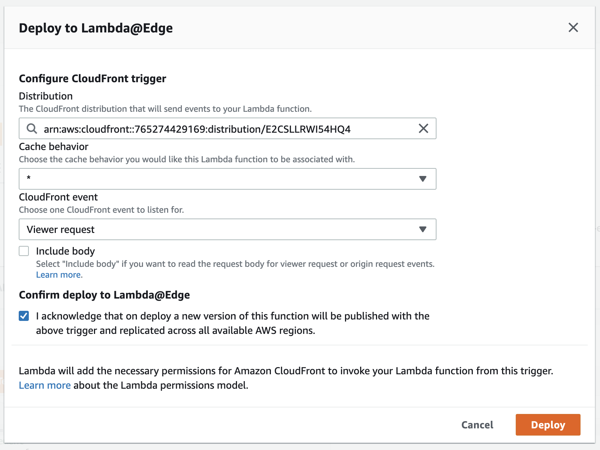
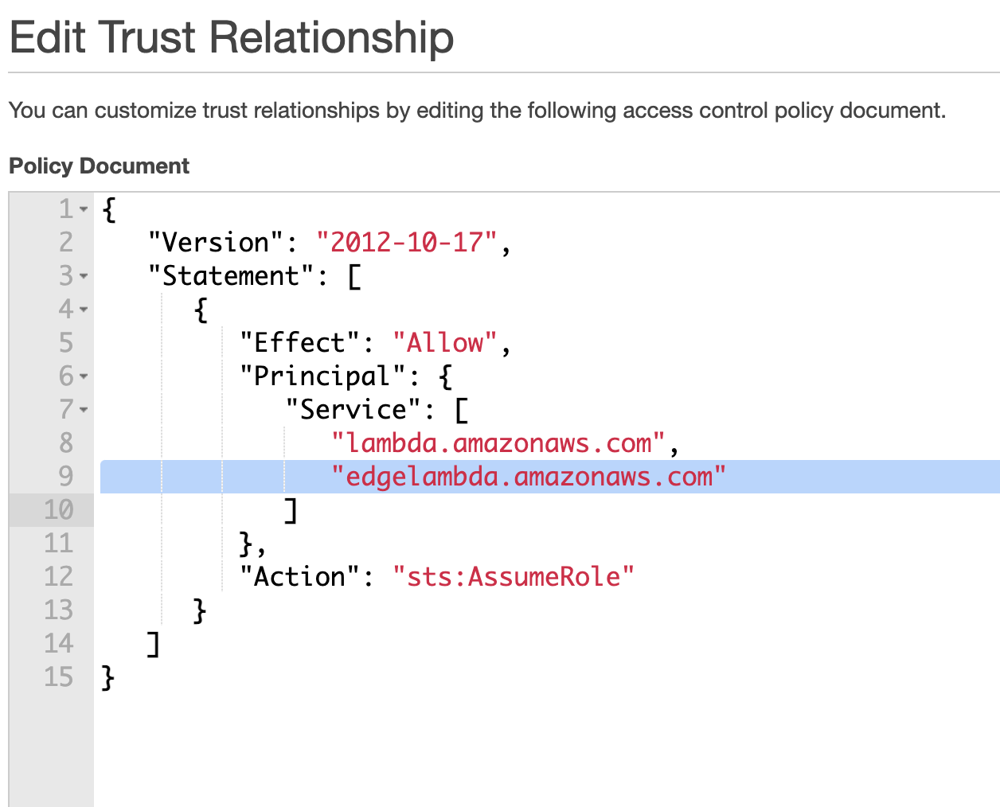

# Lambda@Edge



You can interject logic at any one of four spots in the request/response cycle.

- After CloudFront receives a request from a viewer (viewer request)
- Before CloudFront forwards the request to the origin (origin request)
- After CloudFront receives the response from the origin (origin response)
- Before CloudFront forwards the response to the viewer (viewer response)

### Viewer Request

- Executed on every request before CloudFront’s cache is checked.
- Modify the cache key (URL, cookies, headers, query string).
- Perform authentication and authorization checks.
- Make additional network calls.
- Generate responses (uncached).

### Origin Request

- Executed on a cache miss, before the request is forwarded to the origin.
- You can make external network calls.
- Dynamically set an origin based on the headers.
- Re-write URLs (pretty URLs).
- Cool for stuff like internationalization.

### Origin Response

- Responses from the origin that haven’t been cached yet.
- Executed on cache miss, after a response is received from the origin.
- Make external network calls.
- Modify response headers prior to caching.

### Viewer Response

- Executed on all requests, after a response is received from the origin or cache.
- Modify the response headers without caching the result.
- Make external network calls.

## Deploying a Function







You may get a somewhat cryptic error about permissions. Despite the unhelpfulness of the error, the fix is easy. We just need to add `edgelambda.amazonaws.com` to the policy next to `lambda.amazonaws.com`.



## Recipes

### Redirecting to `index.html` on Valid Client-side Routes

Implement as a **Viewer Request**.

```js
exports.handler = async (event, context) => {
  const request = event.Records[0].cf.request;

  console.log('Before', request.uri);

  if (/notes\/\d(\/edit)?/.test(request.uri)) {
    request.uri = '/index.html';
  }

  console.log('After', request.uri);

  return request;
};
```

### Implementing Security Headers

Implment as a **Viewer Response**.

```js
'use strict';

exports.handler = async (event, context) => {
  const response = event.Records[0].cf.response;
  const headers = response.headers;

  headers['strict-transport-security'] = [
    {
      key: 'Strict-Transport-Security',
      value: 'max-age=63072000; includeSubdomains; preload',
    },
  ];

  headers['content-security-policy'] = [
    {
      key: 'Content-Security-Policy',
      value:
        "default-src 'none'; img-src 'self'; script-src 'self'; style-src 'self'; object-src 'none'",
    },
  ];

  headers['x-content-type-options'] = [
    { key: 'X-Content-Type-Options', value: 'nosniff' },
  ];

  headers['x-frame-options'] = [{ key: 'X-Frame-Options', value: 'DENY' }];

  headers['x-xss-protection'] = [
    { key: 'X-XSS-Protection', value: '1; mode=block' },
  ];

  headers['referrer-policy'] = [
    { key: 'Referrer-Policy', value: 'same-origin' },
  ];

  headers['server'] = [{ key: 'Server', value: 'Erlang on Eels' }];

  return response;
};
```

### Implementing a Redirect

Implement as a **Origin Request**.

```js
exports.handler = async (event, context) => {
  const request = event.Records[0].cf.request;

  const response = {
    status: '302',
    statusDescription: 'Found',
    headers: {
      location: [
        {
          key: 'Location',
          value: 'https://bit.ly/very-secret',
        },
      ],
    },
  };

  if (request.uri === '/secret') {
    console.log('Got it');
    return response;
  }

  return request;
};
```
